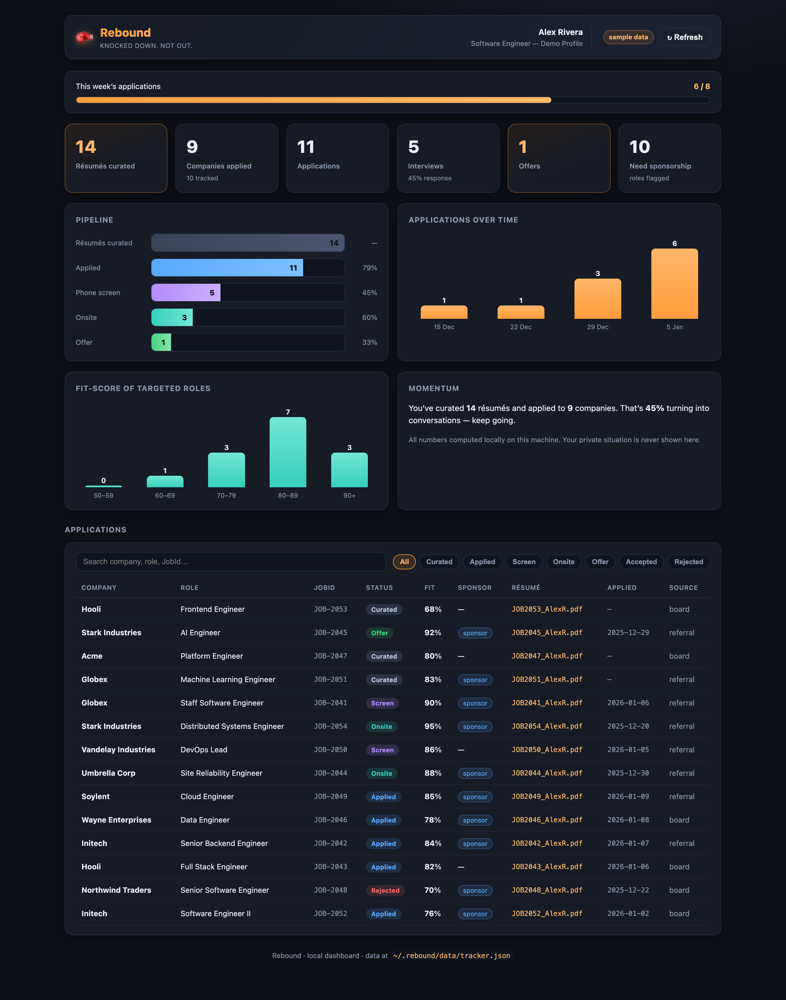

# Rebound — your comeback, engineered 🥊

> **Knocked down. Not out.**

[](https://github.com/snehag01/rebound/stargazers)
[](./LICENSE)
[](./CONTRIBUTING.md)
[](https://github.com/snehag01/rebound/issues?q=is%3Aissue+is%3Aopen+label%3A%22good+first+issue%22)

A Claude Code plugin that turns a job description into a **tailored, honest, ATS-safe résumé** (Word **+** PDF) in one command — then remembers who you are so the next one takes seconds. Built for job seekers, and especially for anyone rebounding after a layoff.

Rebound is **honesty-first**: it makes you look as strong as you *truthfully* are, so the resume that gets you the interview is the same one you can defend in it.

> ⭐ **If Rebound helps you — or you believe laid-off engineers deserve better tools — please [star the repo](https://github.com/snehag01/rebound). Every star helps another job-seeker find it, and brings in contributors who make it better.**

---

## What it does

| Command | What it does |
|---|---|
| `/rebound:start` | Onboards you: reads your **base résumé**, builds a **private profile** (skills, differentiators, and — optionally — your **work authorization & timeline**). |
| `/rebound:tailor <JD or URL>` | Curates a résumé for one role → **`.docx` + text-based `.pdf`** in a folder you choose (or `<Name>_resumes`). Handles Workday/board JSON, flags gaps, keeps it truthful. |
| `/rebound:profile` | View / update your profile, including the private situation. |
| `/rebound:track add\|update ...` | Records an application in your local datastore (`~/.rebound/data/tracker.json`). |
| `/rebound:dashboard` | Launches the **local React dashboard** to visualize progress. |
| `/rebound:match <URLs>` | Scores role fit (50–90%+) and ranks where to spend effort. *(crawling discovery on the roadmap)* |
| `/rebound:rise` | A supportive, practical check-in that respects your runway. *(momentum tracking on the roadmap)* |

### 📊 Local dashboard
A React dashboard (in [`dashboard/`](./dashboard/)) visualizes your search — stat cards, a pipeline funnel, momentum-over-time bars, fit-score distribution, and a per-company table showing the exact résumé curated for each role. Claude Code writes `~/.rebound/data/tracker.json`; the dashboard reads it live on `localhost`. All analytics stay on your machine.



> _Screenshot shows bundled demo data. Your real numbers stay local in `~/.rebound/`._

```bash
cd dashboard && npm install && npm run dev     # → http://localhost:5273
```

### Principles baked in
- **Base résumé is the source of truth** — re-word and re-order, never fabricate.
- **Primary over secondary** — relevant secondary skills support, they don't headline over your real strengths.
- **Fast-learner framing** — a required-but-unused stack is neutralized by genuine adaptability, never a false claim.
- **ATS-safe output** — single column, real text, verified text-layer PDF.
- **Your situation is private** — sponsorship/timeline data is stored **locally only** and never leaves your machine or enters a résumé.

---

## Install

```bash
# In Claude Code:
/plugin marketplace add https://github.com/snehag01/rebound     # GitHub repo (or a local path to your clone)
/plugin install rebound

# First run:
/rebound:start
```

One-time dependency (the exporter installs it for you, or run it yourself):
```bash
python3 -m pip install --target="$HOME/.rebound/pylibs" python-docx
```
PDF conversion uses **LibreOffice** (`brew install --cask libreoffice`) or **Microsoft Word** if present.

---

## Layout

```
rebound/
├── .claude-plugin/
│   ├── plugin.json          # manifest
│   └── marketplace.json     # installable marketplace entry
├── commands/                # /rebound:start · tailor · profile · match · rise
├── skills/
│   ├── resume-tailoring/    # the honesty-first tailoring method
│   ├── resume-export/       # docx + ATS-safe PDF (generic JSON → files)
│   │   └── scripts/         # build_resume.py, to_pdf.py
│   └── profile-memory/      # profile schema + private "situation" handling
└── README.md
```

Data lives in `~/.rebound/` (`profile.json`, `profile.md`, `pylibs/`).

---

## Roadmap

Versioned snapshots live in [`roadmap/`](./roadmap/) (dated `mmddyyyy`; latest = current). Highlights:

- **Role discovery** — crawl career sites/boards for fresh roles, pre-scored by fit % (≥50/60/70/80/90), sponsorship-aware.
- **Application tracking** — statuses, follow-ups, per-role résumé versions.
- **Interview prep & momentum** — reps, streaks, gentle check-ins tied to your timeline.
- **Situation-aware strategy** — sponsorship filters and urgency triage for sponsorship-dependent and thin-runway searches.

---

## 🤝 Contributing — we'd love your help

Rebound is early and **open to contributors of all levels**. Whether you write code, docs, or just have ideas from your own job search, there's a place for you.

- 🌱 **New here?** Start with a [**good first issue**](https://github.com/snehag01/rebound/issues?q=is%3Aissue+is%3Aopen+label%3A%22good+first+issue%22) — each one is self-contained with context and pointers.
- 🙌 **Want something meatier?** See [**help wanted**](https://github.com/snehag01/rebound/issues?q=is%3Aissue+is%3Aopen+label%3A%22help+wanted%22) (dashboard analytics, cross-platform PDF export, the `/rebound:match` engine).
- 💡 **Have an idea or hit a bug?** [Open an issue](https://github.com/snehag01/rebound/issues/new/choose) — lived experience of the job hunt is exactly the perspective this project needs.
- 📖 Read [`CONTRIBUTING.md`](./CONTRIBUTING.md) for setup and the guiding principles (honesty-first, privacy-first).

Comment on an issue to claim it — no PR is too small, and first-time contributors are genuinely welcome. 🥊

If you can't contribute code, the single most helpful thing is to **[⭐ star the repo](https://github.com/snehag01/rebound)** so more job-seekers (and contributors) discover it.

---

*Rebound is supportive software, not a substitute for professional or legal advice. Immigration timelines and mental health both deserve real experts when it counts.*
